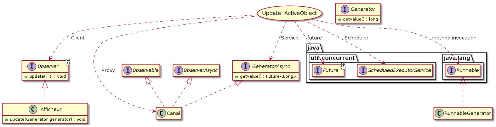
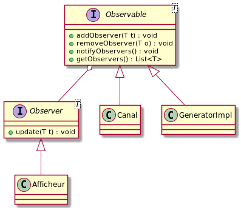
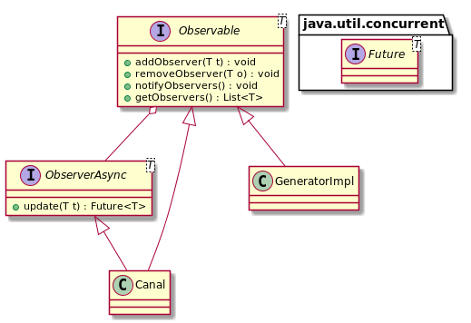
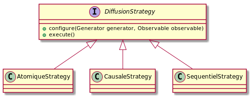

# Projet AOC

[Sujet du projet](TP_observer_parallele.pdf)

## Binômes
* BANNIER Hugo
* LEVAL Antoire 

## Technologies
* Maven 3
* Java 8
* Junit (pour les tests)
* Swing (pour l'IHM)

## Maven

### Compiler le projet
  ```bash
  mvn compile
  ```
### Executer les tests
  ```bash
  mvn test
  ```

### Générer le jar
  ```bash
  mvn package
  ```
### Executer le jar
  ```bash
  mvn java -jar target/m3-1.0-SNAPSHOT.jar
  ```
 

## Documentation

### Patrons de conceptions utilisés

#### Active Object


#### Observer
```
Nous avons employé le patron de conception Observer dans 2 versions, une synchrone et l'autre asynchrone.
```


#### Strategy
```
Le patron de conception strategy permet de choisir une application en fonction d'un context.
Dans notre cas l'interface DiffusionStrategy permet de spécifier les méthodes communes à chaques implémentation. 
```

#### Active Object
#### 